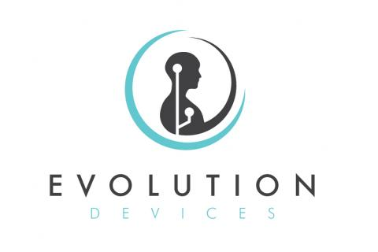
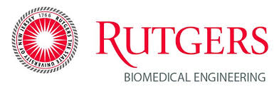



Education
======
<!-- * M.Eng. in Bioengineering, University of California - Berkeley, 2020
  * Computational Biology & Bioinformatics Concentration
  * GPA: 3.86
* B.S. in Biomedical Engineering, Rutgers University - New Brunswick, 2019
  * Minor in Computer Science
  * GPA: 3.53 -->

 &nbsp;
&nbsp;**University of California, Berkeley** 
&nbsp;&nbsp;&nbsp;M.Eng. Bioengineering, 2020  
&nbsp;&nbsp;&nbsp;*Bioinformatics & Computational Biology concentration*  
* GPA: 3.86
* Relevant Courses: 
  * Machine Learning in Computational Biology
  * Probablistic Modeling in Computational Biology
  * Advanced Orthopedic Biomechanics
  * Clinical Need-Based Therapy Solutions
  * Communications for Engineering Leaders
  * Project Management & Teaming
  * Coaching for High Performance Teams
  * R&D Technology Management

  <!-- * Relevant Courses: Machine Learning in Computational Biology, Probablistic Modeling in Computational Biology, Advanced Orthopedic Biomechanics, Clinical Need-Based Therapy Solutions, Communications for Engineering Leaders, Project Management & Teaming, Coaching for High Performance Teams, R&D Technology Management -->

 &nbsp;
&nbsp;**University of Rutgers, New Brunswick** 
&nbsp;&nbsp;&nbsp;B.S. Biomedical Engineering, 2019  
&nbsp;&nbsp;&nbsp;*Computer Science Minor*  
&nbsp;&nbsp;&nbsp;* GPA: 3.53
<!-- * Relevant Courses: Advanced Biomedical Devices, Musculoskeletal Mechanics, Cardiovascular Engineering, Biomaterials, Biomedical Transport Phenomena, Biomechanics, Numerical Modeling in Biomedical Systems, Genetics, Intro to Data Science, Software Methodology, Principles of Information & Data Management, Data Structures -->
* Relevant Courses: 
  * Advanced Biomedical Devices
  * Musculoskeletal Mechanics
  * Cardiovascular Engineering
  * Biomaterials
  * Biomechanics
  * Genetics
  * Biomedical Transport Phenomena
  * Numerical Modeling in Biomedical Systems
  * Intro to Data Science
  * Software Methodology
  * Data Structures
  * Principles of Information & Data Management

Work experience
======
<!-- * R&D Engineer/Capstone Team Leader, Evolution Devices 
  * September 2019 - May 2020
  * Berkeley, CA
  * Duties included: Tagging issues -->

 &nbsp;
&nbsp;**Evolution Devices** 
&nbsp;&nbsp;&nbsp;R&D Engineer, Capstone Team Leader  
&nbsp;&nbsp;&nbsp;*September 2019 - May 2020, Berkeley, CA*   
* Duties included:
  * gang shit

 &nbsp;
&nbsp;**Alcyone Lifesciences** 
&nbsp;&nbsp;&nbsp;R&D Intern  
&nbsp;&nbsp;&nbsp;*June 2018 - August 2018, Lowell, MA*    

 &nbsp;
&nbsp;**Yarmush Lab, Rutgers Biomedical Engineering** 
&nbsp;&nbsp;&nbsp;Research Assistant  
&nbsp;&nbsp;&nbsp;*June 2017 - June 2018, Piscataway, NJ*  
  
Skills
======
* Programming
  * Python
  * MATLAB
  * Java
  * SQL
  * Arduino
  * Bash

* Libraries
  * TensorFlow
  * Keras
  * SciPy
  * Pandas
  * NumPy

* Software
  * SolidWorks
  * LabVIEW
  * ImageJ
  * Microsoft Suite

* Quality
  * ISO 13485
  * FDA QSR
  * Verification Testing
  * Stasitical Analysis

* Technical
  * IMU
  * EMG
  * Biomechanics
  * Signal Processing
  * 3D Printing
  * Rapid Prototyping

* General
  * Communication
  * Leadership
  * Project Management
  * Technical Writing

Awards
======
* Fung Excellence Scholar, UC Berkeley
* Presidential Scholar, Rutgers
* National Merit Scholar, Rutgers

Organizations
======
Biomedical Engineering Honors Society, Rutgers
  * 2017-2019

Delta Upsilon International Fraternity, Rutgers
  * President, 2017-2018
  * VP of Academic Excellence, 2016-2017

Tewksbury First Aid & Rescue Squad, Tewksbury, NJ
  * Volunteer EMT-B, 2013-2017

Portfolio
======
  <ul>
    
  </ul>

Publications
======
  <ul>
    
  </ul>
  